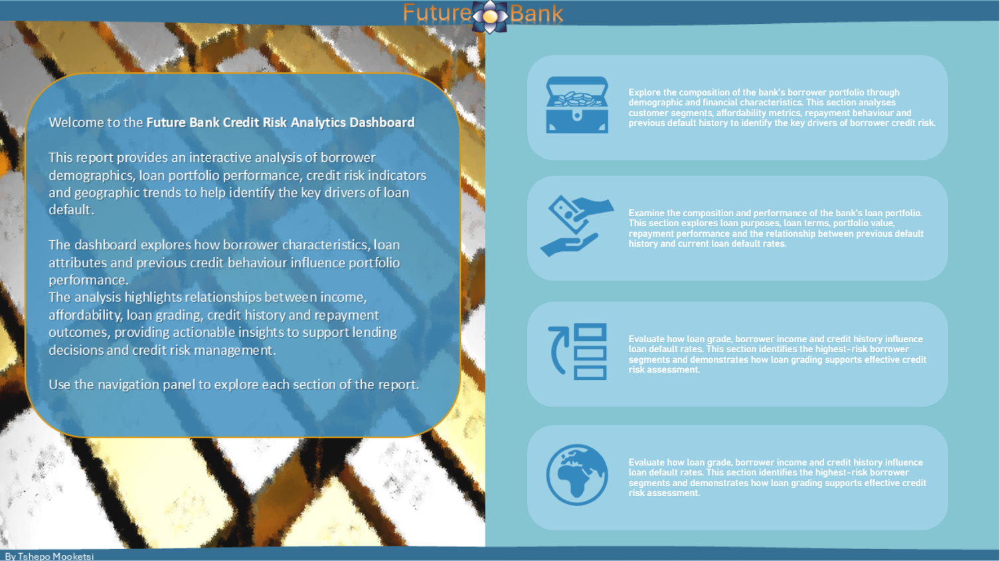
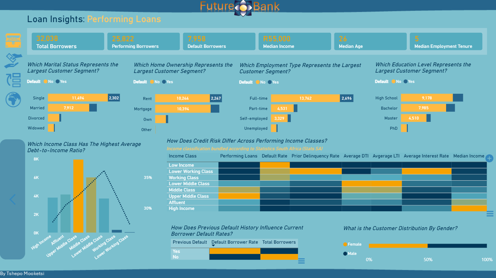
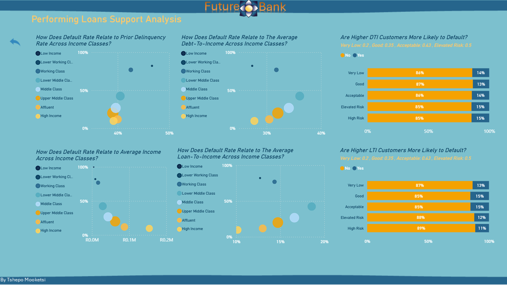
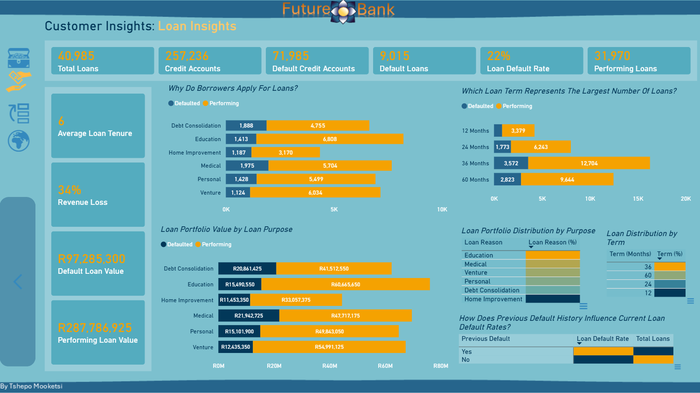
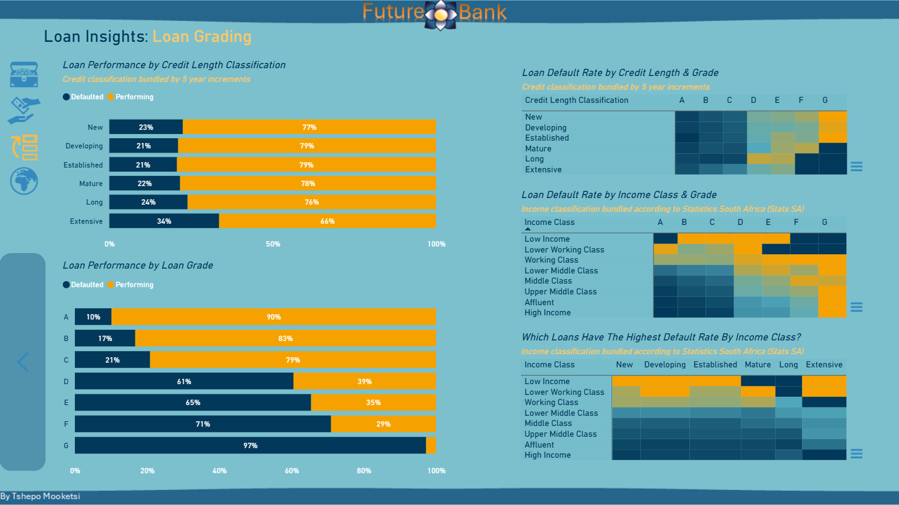
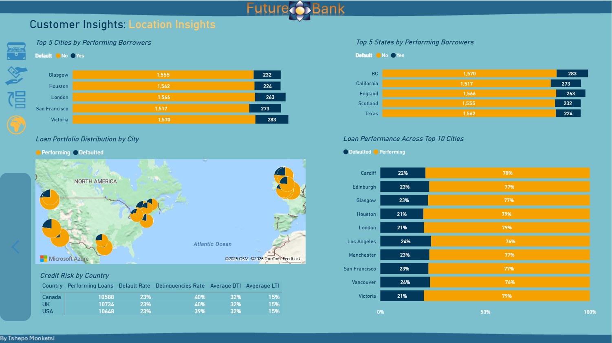
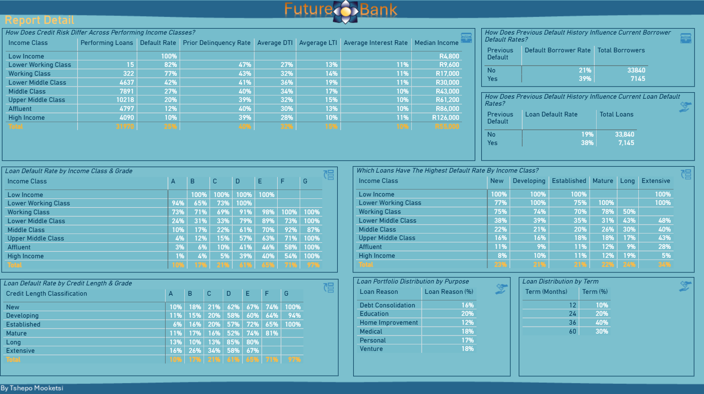

# Banking_Credit_Risk 📊
*About Project*
Developed an interactive Power BI Credit Risk Dashboard using a star schema, Power Query, and DAX to analyze loan performance, customer demographics, default and delinquency trends, income segments, and lending risk. Demonstrates data modelling, KPI development, and business intelligence reporting for data-driven decision-making.


---

# Live Dashboard 📊 

*Experience the interactive version of this dashboard in Power BI.*

👉 **[Launch Dashboard](https://app.fabric.microsoft.com/view?r=eyJrIjoiZDA5OGMxZDgtNTAxMy00YTc3LTk3YzgtNWMzNDZjYzMwMzk3IiwidCI6IjJhYTYxN2E4LTI3NDItNDEwMi04NjgzLTFmYTMzZGE4Nzc3YiJ9&pageName=f83f799969bf3b9946c6)**

---

# 1. Data Modelling & Dataset

The original dataset consisted of a single flat file containing **29 attributes**, where loan, borrower and location information were stored in a single table. To improve scalability, reduce data redundancy the data was transformed into a **star schema model**.

## 1.1 Star Schema Design

The source data was separated into logical business entities:

- **Fact Credit Risk** – Stores loan transactions and measurable business metrics.
- **Dim Person** – Contains borrower demographics and financial attributes.
- **Dim Loan** – Contains descriptive loan information such as purpose, grade and loan term.
- **Dim Location** – Contains geographic information including city, state and country.

Each dimension was created by:

1. Selecting the relevant attributes from the source dataset.
2. Removing duplicate attribute combinations.
3. Creating a surrogate key using an index.
4. Renaming the index to the entity identifier (e.g. `Person_ID`, `Loan_ID`, `Location_ID`).
5. Linking each dimension back to the fact table using one-to-many relationships.

---

## 1.2 Example: Loan Dimension

The original dataset contained over **1,000 loan records**, many of which repeated the same loan attributes.

After selecting the loan-related fields:

- Loan Intent
- Loan Grade
- Loan Term (Months)

Duplicate combinations were removed, reducing the dimension to **166 unique loan profiles**.

A surrogate **Loan_ID** was then generated to uniquely identify each loan attribute combination.

This allows the fact table to store only the surrogate key rather than repeatedly storing descriptive loan information for every transaction.

---

## 1.3 Data Model

The final solution follows a traditional star schema consisting of:

```
                 Dim Person
                      │
                      │
Dim Loan ─────── Fact Credit Risk ─────── Dim Location
```
This modelling approach provides a clean separation between descriptive dimensions and measurable business facts, resulting in a model that is easier to understand, extend and analyse.

---
# 2. Key Insights 📈
##  2.1 Customer Insights: Performing Loans
- Middle Class, Upper Middle Class and Affluent borrowers account for the largest share of the performing loan portfolio.
- Lower Middle Class borrowers exhibit the highest average Debt-to-Income (DTI) and Loan-to-Income (LTI) ratios among the major income segments.
- Despite exhibiting the highest DTI and LTI ratios, the Lower Middle Class also represents one of the largest borrower segments, making it a key group for ongoing credit risk monitoring.
- Borrower default rates decline as income class increases which indicates lower credit risk among higher-income segments.
- Prior delinquency rates are highest among the Working Class and Lower Working Class segments.
- Higher default rates are generally associated with higher Debt-to-Income (DTI) and Loan-to-Income (LTI) ratios across income classes.
- Average credit utilization remains relatively consistent across income classes and DTI/LTI segments, suggesting limited differentiation between customer groups.
- Borrowers with a previous default history exhibit substantially higher current default rates than borrowers with no previous defaults.
###  2.1.1 Dashboard Preview 📊


---

---

##  2.2 Loan Insights: Performing Loans
- Education, Medical and Venture loans account for the largest share of the bank's loan portfolio.
- Education loans represent the highest total lending value, making them the bank's largest credit exposure.
- 36-month loans account for 40% of the portfolio, making them the most common repayment term.
- Borrowers with a previous default history exhibit twice the current default rate (38% vs 19%) compared with borrowers who have no previous defaults.
- Default loan value represents 34% of the total loan portfolio value, highlighting the scale of the bank's credit risk exposure.
###  2.2.1 Dashboard Preview 📊


##  2.3 Loan Insights: Loan Grading
- Loan grade is the strongest predictor of default performance within the lending portfolio.
- Loan grades D–G account for the highest default rates with Grade G representing the riskiest segment of the portfolio.
- Higher-income borrowers consistently exhibit lower default rates across all loan grades.
- Lower Income, Lower Working Class and Working Class borrowers represent the highest-risk customer segments irrespective of credit history classification.
- Credit history length alone does not eliminate default risk particularly for lower-quality loan grades.
###  2.3.1 Dashboard Preview 📊



##  2.4 Loan Insights: Location
- Geographic location has a weaker relationship with credit risk than borrower income, loan grade and previous default history.
- Loan performance is consistent across all major cities and states, with performing loans representing approximately 76–79% of the portfolio.
- Default rates remain virtually unchanged across Canada, the United Kingdom and the United States.
- Borrower affordability metrics (DTI and LTI) show minimal variation across countries.
- The portfolio demonstrates a balanced geographic distribution with no dominant regional concentration.

###  2.4.1 Dashboard Preview 📊


##  2.5 Report Detail
- The report below gives a single page summary for all the matrix visuals. 
###  2.5.1 Dashboard Preview 📊



# 3. Executive Recommendations
- **Strengthen affordability-based lending policies** by placing greater emphasis on Debt-to-Income (DTI) and Loan-to-Income (LTI) ratios during credit assessments.
- **Expand lending within lower-risk customer segments**, particularly higher-income borrowers and applicants with stronger loan grades.
- **Increase monitoring of borrowers with previous defaults or delinquencies**, as historical repayment behaviour remains one of the strongest indicators of future credit risk.
- **Adopt loan grade as the primary risk segmentation metric**, supported by borrower income and affordability measures to improve underwriting and portfolio management.
- **Maintain geographic diversification**, while directing risk management efforts toward borrower and loan characteristics that demonstrate a stronger relationship with default behaviour.
---


 # Author

**Tshepo Mooketsi**

Business Intelligence Analyst with 10 years of experience delivering analytics solutions across the telecoms and retail industries. Microsoft Certified Power BI Data Analyst Associate (PL-300) with expertise in SQL, Power BI, data warehousing, dashboard development, requirements analysis and stakeholder engagement.

### Skills
- Power BI
- DAX
- Power Query
- Data Modelling
- Business Analysis
- Requirements Gathering
- Data Warehousing (EDW)

### Certifications
- Microsoft Certified: Power BI Data Analyst Associate (PL-300)
- [View Microsoft Certification](Images/Power_BI_Certification.pdf)

### Connect With Me
- LinkedIn: [Tshepo Mooketsi](https://www.linkedin.com/in/tshepo-mooketsi-77b892116)

